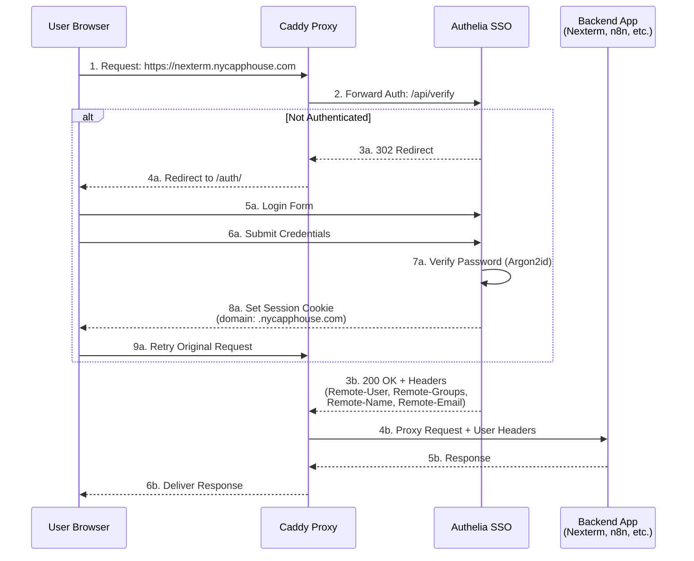
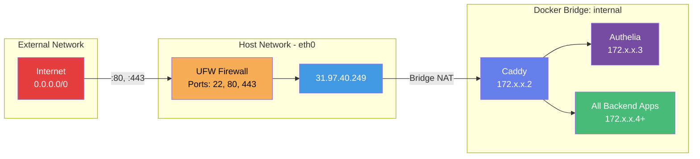
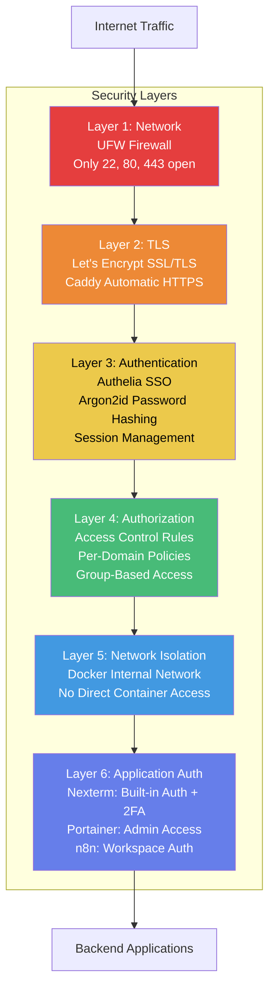
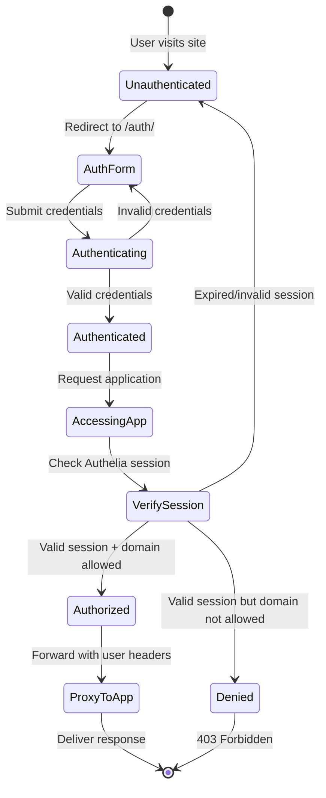
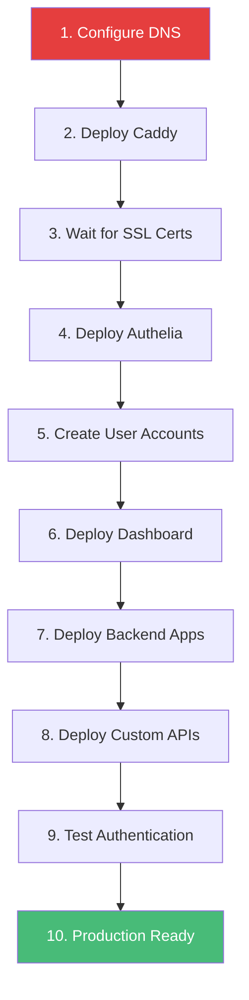

# NYC App House - Walled Garden Architecture

## System Overview

This document provides a comprehensive visual representation of the entire NYC App House walled garden infrastructure, showing all Docker containers, network topology, authentication flow, and external access points.

## Architecture Diagram

```mermaid
graph TB
    subgraph "External Access"
        Internet[Internet Users]
        DNS[DNS: *.nycapphouse.com<br/>31.97.40.249]
    end

    subgraph "Host Server - Ubuntu 24.04"
        subgraph "Docker Network: internal"

            subgraph "Reverse Proxy Layer"
                Caddy[Caddy<br/>:80, :443<br/>SSL/TLS Termination<br/>Let's Encrypt]
            end

            subgraph "Authentication Layer"
                Authelia[Authelia<br/>:9091<br/>SSO Authentication<br/>Session Management<br/>2FA Support]
            end

            subgraph "Backend Applications"
                Excalidraw[Excalidraw<br/>:80<br/>Collaborative Whiteboard]
                N8N[n8n<br/>:5678<br/>Workflow Automation]
                Portainer[Portainer<br/>:9000<br/>Container Management]
                Nexterm[Nexterm<br/>:6989<br/>SSH/VNC/RDP Manager]
            end

            subgraph "Custom APIs"
                UserAdmin[User Admin API<br/>:5000<br/>User Management]
                DNSTools[DNS Tools API<br/>:5001<br/>DNS Utilities]
            end

            subgraph "Static Content"
                Dashboard[Dashboard<br/>HTML/CSS/JS<br/>Application Launcher]
            end
        end

        subgraph "Persistent Storage"
            CaddyData[(Caddy Data<br/>SSL Certificates)]
            CaddyConfig[(Caddy Config)]
            AutheliaDB[(Authelia SQLite<br/>users_database.yml<br/>configuration.yml)]
            PortainerData[(Portainer Data)]
            N8NData[(n8n Data)]
            NextermData[(Nexterm Data<br/>Encrypted Credentials)]
        end

        DockerSocket[/var/run/docker.sock<br/>Docker API]
    end

    %% External connections
    Internet -->|HTTPS :443| Caddy
    Internet -->|HTTP :80<br/>Redirects to HTTPS| Caddy
    DNS -.->|DNS Resolution| Internet

    %% Caddy routing
    Caddy -->|Forward Auth Check| Authelia
    Caddy -->|Serve Static Files| Dashboard

    %% Authenticated routes
    Caddy -->|xcal.nycapphouse.com| Excalidraw
    Caddy -->|/n8n/*| N8N
    Caddy -->|/portainer/*| Portainer
    Caddy -->|nexterm.nycapphouse.com| Nexterm
    Caddy -->|/api/admin/*| UserAdmin
    Caddy -->|/api/dns/*| DNSTools

    %% Storage connections
    Caddy -.->|Volume Mount| CaddyData
    Caddy -.->|Volume Mount| CaddyConfig
    Authelia -.->|Volume Mount| AutheliaDB
    Portainer -.->|Volume Mount| PortainerData
    N8N -.->|Volume Mount| N8NData
    Nexterm -.->|Volume Mount| NextermData

    %% Docker socket access
    Portainer -.->|Container Mgmt| DockerSocket
    UserAdmin -.->|Restart Containers| DockerSocket

    %% Styling
    classDef proxy fill:#667eea,stroke:#333,stroke-width:2px,color:#fff
    classDef auth fill:#764ba2,stroke:#333,stroke-width:2px,color:#fff
    classDef app fill:#48bb78,stroke:#333,stroke-width:2px,color:#fff
    classDef api fill:#ed8936,stroke:#333,stroke-width:2px,color:#fff
    classDef storage fill:#4299e1,stroke:#333,stroke-width:2px,color:#fff
    classDef static fill:#ecc94b,stroke:#333,stroke-width:2px,color:#000
    classDef external fill:#e53e3e,stroke:#333,stroke-width:2px,color:#fff

    class Caddy proxy
    class Authelia auth
    class Excalidraw,N8N,Portainer,Nexterm app
    class UserAdmin,DNSTools api
    class Dashboard static
    class CaddyData,CaddyConfig,AutheliaDB,PortainerData,N8NData,NextermData storage
    class Internet,DNS external
```

## Authentication Flow Diagram



## Network Topology



## Container Details

| Container | Image | Ports (Internal) | Purpose | Data Volume |
|-----------|-------|------------------|---------|-------------|
| **caddy** | caddy:latest | 80, 443 (published)<br/>2019 (metrics) | Reverse proxy, SSL termination, routing | caddy_data, caddy_config |
| **authelia** | authelia/authelia:latest | 9091 | SSO authentication, session management, 2FA | authelia/config (bind mount) |
| **excalidraw** | excalidraw/excalidraw:latest | 80 | Collaborative whiteboard and diagramming | None (stateless) |
| **n8n** | n8nio/n8n:latest | 5678 | Workflow automation and integration platform | n8n_data |
| **portainer** | portainer/portainer-ce:latest | 9000, 8000, 9443 | Docker container management UI | portainer_data |
| **nexterm** | germannewsmaker/nexterm:latest | 6989 | Server management (SSH/VNC/RDP) | nexterm_data |
| **user-admin** | (custom build) | 5000 | User management API for Authelia | authelia/config (shared) |
| **dns-tools** | (custom build) | 5001 | DNS query and troubleshooting tools | None (stateless) |

## DNS Routing Table

| Domain | Target | Purpose |
|--------|--------|---------|
| run.nycapphouse.com | 31.97.40.249 | Main dashboard and authentication portal |
| xcal.nycapphouse.com | 31.97.40.249 | Excalidraw main application |
| xcal-storage.nycapphouse.com | 31.97.40.249 | Excalidraw storage backend |
| xcal-collab.nycapphouse.com | 31.97.40.249 | Excalidraw collaboration backend |
| nexterm.nycapphouse.com | 31.97.40.249 | Nexterm server management |

## URL Routing Map

```mermaid
graph TD
    Root[https://run.nycapphouse.com]

    Root -->|/| Dashboard[Dashboard HTML]
    Root -->|/auth/*| Authelia[Authelia Portal]
    Root -->|/api/verify| AuthAPI[Auth Verification]
    Root -->|/api/admin/*| UserAdmin[User Admin API]
    Root -->|/api/dns/*| DNSTools[DNS Tools API]
    Root -->|/portainer/*| Portainer[Portainer UI]
    Root -->|/n8n/*| N8N[n8n Workflows]

    XCal[https://xcal.nycapphouse.com] --> Excalidraw[Excalidraw App]
    XCalStorage[https://xcal-storage.nycapphouse.com] --> Excalidraw
    XCalCollab[https://xcal-collab.nycapphouse.com] --> Excalidraw

    Nexterm[https://nexterm.nycapphouse.com] --> NextermApp[Nexterm App]

    style Root fill:#667eea,color:#fff
    style Dashboard fill:#ecc94b,color:#000
    style Authelia fill:#764ba2,color:#fff
    style AuthAPI fill:#764ba2,color:#fff
    style UserAdmin fill:#ed8936,color:#fff
    style DNSTools fill:#ed8936,color:#fff
    style Portainer fill:#48bb78,color:#fff
    style N8N fill:#48bb78,color:#fff
    style Excalidraw fill:#48bb78,color:#fff
    style NextermApp fill:#48bb78,color:#fff
```



## Security Architecture



## Data Flow: User Session



## File System Layout

```
/opt/authelia-stack/
├── docker-compose.yml          # Service orchestration
├── Caddyfile                   # Reverse proxy configuration
├── dashboard/
│   ├── index.html             # Main launcher page
│   ├── admin.html             # User management UI
│   └── dns.html               # DNS tools UI
├── authelia/
│   ├── configuration.yml      # Authelia config (secrets!)
│   ├── users_database.yml     # User accounts (password hashes)
│   ├── db.sqlite3            # Session storage
│   └── notification.log      # Auth notifications
├── user-admin/
│   ├── app.py                # Flask API for user management
│   ├── requirements.txt      # Python dependencies
│   └── Dockerfile            # Container build
└── dns-tools/
    ├── app.py                # Flask API for DNS tools
    ├── requirements.txt      # Python dependencies
    └── Dockerfile            # Container build

Docker Volumes:
├── caddy_data                 # SSL certificates (Let's Encrypt)
├── caddy_config              # Caddy runtime config
├── portainer_data            # Portainer settings & users
├── n8n_data                  # Workflow data & credentials
└── nexterm_data              # Server configs & encrypted creds
```

## System Requirements

- **OS:** Ubuntu 24.04 LTS
- **Docker:** 20.10+
- **Docker Compose:** v2.0+
- **RAM:** 2GB minimum (4GB+ recommended)
- **Disk:** 20GB+ for containers and volumes
- **Network:** Public IP with DNS control
- **Firewall:** UFW configured (ports 22, 80, 443)

## Deployment Order



## Monitoring & Logs

### View Logs
```bash
# All services
docker compose logs -f

# Specific service
docker compose logs -f caddy
docker compose logs -f authelia
docker compose logs -f nexterm

# Last N lines
docker compose logs --tail=50 authelia
```

### Container Status
```bash
docker compose ps
docker compose top
```

### Resource Usage
```bash
docker stats
```

## Backup Strategy

### Critical Data
1. **Authelia Configuration:** `/opt/authelia-stack/authelia/`
   - Contains user accounts, secrets, configuration
   - Backup frequency: Daily

2. **Docker Volumes:** All persistent data
   - caddy_data (SSL certificates)
   - nexterm_data (server credentials)
   - n8n_data (workflows)
   - portainer_data (container config)
   - Backup frequency: Daily

3. **Custom Code:** `/opt/authelia-stack/user-admin/`, `/opt/authelia-stack/dns-tools/`
   - Backup frequency: On change

### Backup Command
```bash
# Full backup
tar -czf backup-$(date +%Y%m%d).tar.gz \
  -C /opt/authelia-stack \
  --exclude='volumes' \
  --exclude='*.log' \
  .

# Volume backup
docker run --rm \
  -v authelia-stack_nexterm_data:/data \
  -v $(pwd):/backup \
  alpine tar czf /backup/nexterm-$(date +%Y%m%d).tar.gz /data
```

## Recovery Procedures

### Service Restart
```bash
cd /opt/authelia-stack
docker compose restart <service>
```

### Full Stack Restart
```bash
docker compose down
docker compose up -d
```

### Certificate Renewal
Automatic via Caddy (Let's Encrypt ACME)

### Lost Admin Access
```bash
# Reset Authelia user password
docker run --rm -it authelia/authelia:latest \
  authelia hash-password 'NewPassword'
# Update users_database.yml with new hash
docker compose restart authelia
```

## Performance Considerations

- **Caddy:** Handles ~1000 req/s on modest hardware
- **Authelia:** Session cache in SQLite (upgrade to Redis for high scale)
- **Docker Network:** Bridge mode (adequate for <100 concurrent users)
- **SSL Termination:** Caddy efficiently handles TLS with HTTP/2

## Future Enhancements

- [ ] Add Redis for Authelia session storage (scalability)
- [ ] Implement log aggregation (Loki + Grafana)
- [ ] Add health check monitoring (Uptime Kuma)
- [ ] Configure automated backups to S3
- [ ] Add rate limiting at Caddy level
- [ ] Implement fail2ban for SSH protection

---

**Last Updated:** 2025-11-18
**Contributors:** See GitHub contributors list
