# NYC App House Walled Garden Architecture

Complete visual documentation of the run.nycapphouse.com Docker-based authentication gateway.

**Last Updated**: 2025-11-18
**Infrastructure**: Docker Compose + Caddy + Authelia

---

## 1. Network Architecture Overview

This diagram shows all Docker containers, the internal network, and external access points.


**Key Points:**
- Only Caddy exposes ports to the internet (80, 443)
- All services communicate on the `internal` Docker network
- Two services have Docker socket access: user-admin, portainer
- Dashboard served as static files from host filesystem

---

## 2. Authentication Flow (Forward Auth Pattern)

This sequence diagram shows how Authelia protects resources using Caddy's forward_auth.

```mermaid
sequenceDiagram
    actor User
    participant Caddy as 🌐 Caddy<br/>Reverse Proxy
    participant Authelia as 🔐 Authelia<br/>SSO Gateway
    participant Backend as 🎯 Backend Service<br/>(Portainer, n8n, etc.)

    User->>Caddy: GET /portainer/

    rect rgb(255, 240, 200)
        Note over Caddy,Authelia: Forward Auth Check
        Caddy->>Authelia: GET /api/verify?rd=https://run.nycapphouse.com/auth/

        alt User Has Valid Session Cookie
            Authelia->>Authelia: Verify session cookie<br/>.nycapphouse.com domain
            Authelia-->>Caddy: 200 OK<br/>+ Headers:<br/>Remote-User: dustin<br/>Remote-Groups: admins,users<br/>Remote-Name: Dustin<br/>Remote-Email: dustin@example.com

            rect rgb(200, 255, 200)
                Note over Caddy,Backend: Request Authorized ✓
                Caddy->>Backend: GET /<br/>+ User Context Headers
                Backend->>Backend: Process request<br/>knows user identity
                Backend-->>Caddy: Response
                Caddy-->>User: Response
            end

        else No Valid Session
            Authelia-->>Caddy: 302 Redirect<br/>Location: https://run.nycapphouse.com/auth/
            Caddy-->>User: 302 Redirect to Login

            rect rgb(255, 200, 200)
                Note over User,Authelia: User Must Authenticate
                User->>Authelia: GET /auth/
                Authelia-->>User: Login Page
                User->>Authelia: POST /auth/<br/>username + password + TOTP
                Authelia->>Authelia: Verify credentials<br/>users_database.yml
                Authelia-->>User: 302 Redirect to original URL<br/>+ Set-Cookie: session=...<br/>domain=.nycapphouse.com
                User->>Caddy: GET /portainer/<br/>+ Cookie: session=...
                Note over Caddy,Backend: Retry original request (now with cookie)
            end
        end
    end
```



**Key Points:**
- Every protected request triggers a subrequest to Authelia
- Session cookie shared across all `*.nycapphouse.com` domains (SSO)
- Backend services receive user identity via headers
- Unauthenticated users redirected to login, then back to original URL

---

## 3. Domain & Path Routing

Shows all domains and how requests are routed to backend services.

```mermaid
graph LR
    subgraph "External Domains"
        D1[run.nycapphouse.com]
        D2[xcal.nycapphouse.com]
        D3[xcal-storage.nycapphouse.com]
        D4[xcal-collab.nycapphouse.com]
        D5[nexterm.nycapphouse.com]
    end

    subgraph "run.nycapphouse.com Routing"
        D1 --> NoAuth{Path requires auth?}

        NoAuth -->|/auth/*| A1["Authelia<br/>Login Portal<br/>❌ No Auth"]
        NoAuth -->|/static/*| A1
        NoAuth -->|/api/verify*| A1
        NoAuth -->|/api/authz/*| A1
        NoAuth -->|/locales/*| A1

        NoAuth -->|All other paths| Auth{Authenticated?}

        Auth -->|✓ Yes| Routes{Path?}
        Auth -->|✗ No| Redirect["302 Redirect to /auth/"]

        Routes -->|/api/admin/*| UA["User-Admin API<br/>Port 5000<br/>🔒 Admin Only"]
        Routes -->|/api/dns/*| DNS["DNS-Tools API<br/>Port 5001<br/>🔒 Auth Required"]
        Routes -->|/portainer/*| Port["Portainer<br/>Port 9000<br/>🔒 Auth Required"]
        Routes -->|/n8n/*| N8N["n8n<br/>Port 5678<br/>🔒 Auth Required"]
        Routes -->|/ or .html| Static["Static Files<br/>/srv/dashboard<br/>🔒 Auth Required"]
    end

    D2 --> XCal1{Authenticated?}
    XCal1 -->|✓| Excal1["Excalidraw Port 80"]
    XCal1 -->|✗| R1["302 Redirect to /auth/"]

    D3 --> XCal2{Authenticated?}
    XCal2 -->|✓| Excal2["Excalidraw Port 80<br/>Storage Backend"]
    XCal2 -->|✗| R2["302 Redirect to /auth/"]

    D4 --> XCal3{Authenticated?}
    XCal3 -->|✓| Excal3["Excalidraw Port 80<br/>Collab Backend"]
    XCal3 -->|✗| R3["302 Redirect to /auth/"]

    D5 --> Nex{Authenticated?}
    Nex -->|✓| NextermB["Nexterm Port 6989<br/>SSH/VNC/RDP"]
    Nex -->|✗| R4["302 Redirect to /auth/"]

    style A1 fill:#95a5a6,stroke:#333,stroke-width:2px
    style UA fill:#e74c3c,stroke:#333,stroke-width:2px,color:#fff
    style DNS fill:#3498db,stroke:#333,stroke-width:2px,color:#fff
    style Port fill:#2ecc71,stroke:#333,stroke-width:2px,color:#fff
    style N8N fill:#9b59b6,stroke:#333,stroke-width:2px,color:#fff
    style Static fill:#f39c12,stroke:#333,stroke-width:2px,color:#fff
```



**Path Summary:**
- **5 domains** total (1 main + 4 service-specific)
- **5 public paths** on run.nycapphouse.com (Authelia endpoints only)
- **All other paths** require authentication
- **Admin API** additionally checks `Remote-Groups` header for "admins"

---

## 4. Service Dependencies & Communication

Shows which services communicate with each other and how.

```mermaid
graph TB
    subgraph "Entry Point"
        Caddy[🌐 Caddy]
    end

    subgraph "Authentication Layer"
        Authelia[🔐 Authelia]
        UsersDB[(users_database.yml)]
    end

    subgraph "Custom APIs"
        UserAdmin[⚙️ User-Admin API]
        DNSTools[🔍 DNS-Tools API]
    end

    subgraph "Application Layer"
        Dashboard[📄 Dashboard HTML]
        Excalidraw[📊 Excalidraw]
        Portainer[🐳 Portainer]
        N8N[🔄 n8n]
        Nexterm[💻 Nexterm]
    end

    subgraph "System Layer"
        DockerEngine[🐋 Docker Engine]
        DigCommand[dig command]
    end

    Caddy -->|forward_auth| Authelia
    Caddy -->|reverse_proxy| UserAdmin
    Caddy -->|reverse_proxy| DNSTools
    Caddy -->|reverse_proxy| Portainer
    Caddy -->|reverse_proxy| N8N
    Caddy -->|reverse_proxy| Excalidraw
    Caddy -->|reverse_proxy| Nexterm
    Caddy -->|file_server| Dashboard

    Authelia -.->|reads| UsersDB

    UserAdmin -->|reads/writes| UsersDB
    UserAdmin -->|docker restart authelia| DockerEngine
    UserAdmin -->|docker run - hash password| DockerEngine

    DNSTools -->|subprocess.run| DigCommand

    Portainer -->|docker API| DockerEngine

    Dashboard -.->|AJAX calls| UserAdmin
    Dashboard -.->|AJAX calls| DNSTools

    style Caddy fill:#667eea,stroke:#333,stroke-width:4px,color:#fff
    style Authelia fill:#f39c12,stroke:#333,stroke-width:3px,color:#fff
    style UserAdmin fill:#e74c3c,stroke:#333,stroke-width:2px,color:#fff
    style DNSTools fill:#3498db,stroke:#333,stroke-width:2px,color:#fff
```



**Communication Patterns:**

| Service | Communicates With | Method | Purpose |
|---------|-------------------|--------|---------|
| Caddy | Authelia | HTTP subrequest | Forward auth verification |
| Caddy | All backends | HTTP reverse proxy | Route user requests |
| User-Admin | Authelia | File I/O | Read/write users_database.yml |
| User-Admin | Docker | Socket API | Restart Authelia, hash passwords |
| DNS-Tools | System | subprocess | Execute dig commands |
| Portainer | Docker | Socket API | Manage containers |
| Dashboard | APIs | AJAX fetch | User management, DNS queries |

---

## 5. Volume Mounts & Data Persistence

Shows how data is stored and shared between containers and host.

```mermaid
graph TB
    subgraph "Host Filesystem: /opt/authelia-stack/"
        H1["📁 Caddyfile"]
        H2["📁 dashboard/<br/>index.html<br/>admin.html<br/>dns.html<br/>test.html"]
        H3["📁 authelia/<br/>configuration.yml<br/>users_database.yml"]
        H4["📁 user-admin/<br/>app.py<br/>Dockerfile"]
        H5["📁 dns-tools/<br/>app.py<br/>Dockerfile"]
    end

    subgraph "Host System"
        DockerSock["🔌 /var/run/docker.sock"]
    end

    subgraph "Docker Named Volumes"
        V1["caddy_data<br/>ACME/SSL certs"]
        V2[(caddy_config)]
        V3[(portainer_data)]
        V4[(n8n_data<br/>Workflows)]
        V5[(nexterm_data<br/>Server configs)]
    end

    subgraph "Docker Containers"
        C1[🌐 Caddy]
        C2[🔐 Authelia]
        C3[⚙️ User-Admin]
        C4[🔍 DNS-Tools]
        C5[🐳 Portainer]
        C6[🔄 n8n]
        C7[💻 Nexterm]
    end

    H1 -.->|mount ro| C1
    H2 -.->|mount /srv| C1
    V1 -.->|volume| C1
    V2 -.->|volume| C1

    H3 -.->|mount /config| C2
    H3 -.->|mount /config| C3

    DockerSock -.->|mount| C3
    DockerSock -.->|mount| C5

    V3 -.->|volume| C5
    V4 -.->|volume| C6
    V5 -.->|volume| C7

    style H3 fill:#f39c12,stroke:#333,stroke-width:3px
    style DockerSock fill:#e74c3c,stroke:#333,stroke-width:2px
    style V1 fill:#2ecc71,stroke:#333,stroke-width:2px
```



**Volume Summary:**

| Mount Type | Source | Target | Container(s) | Purpose |
|------------|--------|--------|--------------|---------|
| **Bind (RO)** | Caddyfile | /etc/caddy/Caddyfile | Caddy | Routing configuration |
| **Bind** | dashboard/ | /srv | Caddy | Static HTML files |
| **Bind (Shared)** | authelia/ | /config | Authelia, User-Admin | Config + user database |
| **Socket** | docker.sock | docker.sock | User-Admin, Portainer | Docker control |
| **Volume** | caddy_data | /data | Caddy | SSL certificates (Let's Encrypt) |
| **Volume** | caddy_config | /config | Caddy | Caddy runtime config |
| **Volume** | portainer_data | /data | Portainer | Portainer database |
| **Volume** | n8n_data | /home/node/.n8n | n8n | Workflow definitions |
| **Volume** | nexterm_data | /app/data | Nexterm | Server connection configs |

---

## 6. Complete System Topology

High-level view showing all components and their relationships.

```mermaid
graph TB
    Internet([🌍 Internet])

    Internet --> Firewall{Firewall<br/>UFW}

    Firewall -->|Port 22| SSH[SSH Access]
    Firewall -->|Port 80| HTTP
    Firewall -->|Port 443| HTTPS

    HTTP --> Caddy
    HTTPS --> Caddy

    subgraph "Docker Compose Stack: authelia-stack"
        Caddy[🌐 Caddy<br/>SSL/TLS Termination<br/>Reverse Proxy]

        Caddy -.->|All Requests| AuthCheck{Forward Auth}

        AuthCheck -->|Verify| Authelia[🔐 Authelia<br/>SSO + 2FA]

        AuthCheck -->|Authorized| Services

        subgraph Services["Backend Services"]
            direction TB
            UA[⚙️ User-Admin<br/>Python/Flask]
            DNS[🔍 DNS-Tools<br/>Python/Gunicorn]
            EX[📊 Excalidraw]
            PT[🐳 Portainer]
            N8[🔄 n8n]
            NX[💻 Nexterm]
        end

        Caddy -->|/api/admin/*| UA
        Caddy -->|/api/dns/*| DNS
        Caddy -->|xcal.*| EX
        Caddy -->|/portainer/*| PT
        Caddy -->|/n8n/*| N8
        Caddy -->|nexterm.*| NX
    end

    subgraph Data["Data Storage"]
        Host["📁 Host Files<br/>/opt/authelia-stack/"]
        Volumes["Docker Volumes<br/>caddy_data, n8n_data, etc."]
    end

    Authelia -.-> Host
    UA -.-> Host
    Caddy -.-> Host
    Caddy -.-> Volumes
    PT -.-> Volumes
    N8 -.-> Volumes
    NX -.-> Volumes

    UA -.->|Docker Socket| DockerEngine[🐋 Docker Engine]
    PT -.->|Docker Socket| DockerEngine

    style Caddy fill:#667eea,stroke:#333,stroke-width:4px,color:#fff
    style Authelia fill:#f39c12,stroke:#333,stroke-width:3px,color:#fff
    style Services fill:#e8f4f8,stroke:#3498db,stroke-width:2px
    style Data fill:#fef5e7,stroke:#f39c12,stroke-width:2px
```



---

## 7. Security Architecture

Visual representation of the zero-trust security model.

```mermaid
graph TB
    subgraph "Security Perimeter"
        Internet[🌍 Internet<br/>Untrusted]
    end

    subgraph "DMZ - Entry Point"
        Firewall[🔥 UFW Firewall<br/>Ports: 22, 80, 443]
        Caddy[🌐 Caddy<br/>SSL/TLS Termination<br/>HTTPS Only]
    end

    subgraph "Authentication Layer"
        Authelia[🔐 Authelia SSO]
        Session[🍪 Session Cookie<br/>domain=.nycapphouse.com<br/>httpOnly, secure, sameSite]
        UserDB[(👥 User Database<br/>Argon2id hashed passwords<br/>TOTP 2FA secrets)]
    end

    subgraph "Authorization Layer"
        Headers[📋 User Context Headers<br/>Remote-User<br/>Remote-Groups<br/>Remote-Name<br/>Remote-Email]
        AdminCheck{Admin Group?}
    end

    subgraph "Isolated Backend - Internal Network Only"
        PublicServices[📱 Public Services<br/>Excalidraw, Portainer, n8n, Nexterm]
        AdminServices[⚙️ Admin Services<br/>User-Admin API<br/>requires Remote-Groups: admins]
        AuthServices[🔍 Authenticated Services<br/>DNS-Tools API]
    end

    Internet --> Firewall
    Firewall -->|HTTPS :443| Caddy
    Caddy -.->|Every Request| Authelia

    Authelia <-.-> Session
    Authelia <-.-> UserDB

    Authelia -->|200 OK| Headers
    Authelia -->|302 Redirect| LoginPage["Login Portal at /auth/"]

    Headers --> AdminCheck
    AdminCheck -->|✓ Has 'admins' group| AdminServices
    AdminCheck -->|✗ User/other groups| PublicServices
    Headers --> AuthServices

    style Firewall fill:#e74c3c,stroke:#333,stroke-width:3px,color:#fff
    style Authelia fill:#f39c12,stroke:#333,stroke-width:3px,color:#fff
    style AdminServices fill:#c0392b,stroke:#333,stroke-width:2px,color:#fff
    style PublicServices fill:#27ae60,stroke:#333,stroke-width:2px,color:#fff
```



**Security Measures:**

1. **Network Isolation**: All services on internal Docker network, no published ports except Caddy
2. **Zero Trust**: Every request authenticated before reaching backend
3. **Strong Passwords**: Argon2id hashing (m=65536, t=3, p=4)
4. **2FA Support**: TOTP (Time-based One-Time Password)
5. **Session Security**: httpOnly, secure, sameSite cookies
6. **SSL/TLS**: Automatic Let's Encrypt certificates via ACME
7. **Command Injection Prevention**: Whitelisted parameters, no shell execution
8. **Group-Based Authorization**: Admin endpoints check Remote-Groups header
9. **Audit Trail**: All Docker socket operations logged
10. **Timeout Protection**: 30s max for DNS queries, 60s for Gunicorn workers

---

## 8. Data Flow: User Creates Account

Example end-to-end flow showing multiple service interactions.

```mermaid
sequenceDiagram
    actor Admin as 👤 Admin User
    participant Browser as 🖥️ Browser
    participant Caddy as 🌐 Caddy
    participant Authelia as 🔐 Authelia
    participant AdminAPI as ⚙️ User-Admin API
    participant FileSystem as 📁 File System
    participant Docker as 🐋 Docker Engine

    Admin->>Browser: Navigate to /admin.html
    Browser->>Caddy: GET /admin.html
    Caddy->>Authelia: Forward Auth: /api/verify
    Authelia-->>Caddy: 200 OK + Remote-Groups: admins
    Caddy-->>Browser: admin.html static file

    Admin->>Browser: Fill form:<br/>username, password, email, displayname, groups
    Browser->>Browser: Hash password with bcrypt<br/>client-side pre-hash

    Browser->>Caddy: POST /api/admin/users<br/>+ Cookie: session=...<br/>Body: {username, password, email, ...}
    Caddy->>Authelia: Forward Auth: /api/verify
    Authelia-->>Caddy: 200 OK + Remote-Groups: admins

    Note over Caddy,AdminAPI: ✓ Admin authorized

    Caddy->>AdminAPI: POST /users<br/>+ Remote-User: dustin<br/>+ Remote-Groups: admins<br/>Body: {username, password, ...}

    AdminAPI->>AdminAPI: Check Remote-Groups<br/>contains "admins"

    rect rgb(200, 230, 255)
        Note over AdminAPI,Docker: Password Hashing
        AdminAPI->>Docker: docker run authelia/authelia:latest<br/>authelia crypto hash generate argon2<br/>--password "userPassword"
        Docker-->>AdminAPI: $argon2id$v=19$m=65536$...
    end

    AdminAPI->>FileSystem: Read /config/users_database.yml
    FileSystem-->>AdminAPI: Current users YAML

    AdminAPI->>AdminAPI: Append new user:<br/>username:<br/>  displayname: ...<br/>  password: $argon2id$...<br/>  email: ...<br/>  groups: [users]

    AdminAPI->>FileSystem: Write /config/users_database.yml

    rect rgb(255, 230, 200)
        Note over AdminAPI,Docker: Restart Required
        AdminAPI->>Docker: docker restart authelia
        Docker->>Authelia: SIGTERM graceful shutdown
        Authelia->>Authelia: Reload config + users_database.yml
        Docker-->>AdminAPI: Container restarted
    end

    AdminAPI-->>Caddy: 200 OK<br/>{success: true, message: "User created"}
    Caddy-->>Browser: 200 OK
    Browser->>Browser: Show success notification
    Browser-->>Admin: ✓ User newuser created
```



---

## Architecture Summary

### Stack Components
- **8 Docker Containers** (1 proxy, 1 auth, 2 custom APIs, 4 applications)
- **5 Domains** (run, xcal, xcal-storage, xcal-collab, nexterm)
- **1 Internal Network** (all containers isolated)
- **2 External Ports** (80 HTTP, 443 HTTPS)
- **5 Named Volumes** (persistent data)
- **5 Bind Mounts** (configuration from host)

### Technology Stack
- **Reverse Proxy**: Caddy (automatic SSL via Let's Encrypt)
- **Authentication**: Authelia (SSO with optional 2FA)
- **Container Orchestration**: Docker Compose
- **Custom APIs**: Python 3.11 + Flask + Gunicorn
- **Network**: Docker bridge network (internal isolation)
- **Storage**: File-based (YAML) + Docker volumes

### Key Design Patterns
1. **Zero Trust**: All requests authenticated before reaching services
2. **Forward Auth**: Centralized authentication via Authelia
3. **Network Isolation**: Services accessible only through Caddy
4. **Shared Sessions**: SSO via parent domain cookie (`.nycapphouse.com`)
5. **Docker Socket Pattern**: Controlled access for management services
6. **Volume Sharing**: Authelia config shared between auth and admin services
7. **Static + Dynamic**: Dashboard served from host, APIs in containers

---

## Viewing These Diagrams

### Online
- **GitHub**: Automatically renders Mermaid in .md files
- **Mermaid Live Editor**: https://mermaid.live (paste code blocks)

### Local Editors
- **VS Code**: Install "Markdown Preview Mermaid Support" extension
- **Obsidian**: Built-in Mermaid support
- **Typora**: Built-in Mermaid rendering

### Export Options
```bash
# Using Mermaid CLI (requires Node.js)
npm install -g @mermaid-js/mermaid-cli

# Convert to PNG
mmdc -i walled-garden-architecture.mermaid.md -o diagram.png

# Convert to SVG
mmdc -i walled-garden-architecture.mermaid.md -o diagram.svg

# Convert to PDF
mmdc -i walled-garden-architecture.mermaid.md -o diagram.pdf
```

---

**Related Documentation:**
- Architecture Overview: `/home/dust/walledgarden/CLAUDE.md`
- DNS Tool Details: `/home/dust/walledgarden/dns-tool-architecture.md`
- Nexterm Installation: `/home/dust/walledgarden/NEXTERM-INSTALLATION.md`
- Original PDR: `/home/dust/walledgarden/Authelia-Walled-Garden-PDR.md`
